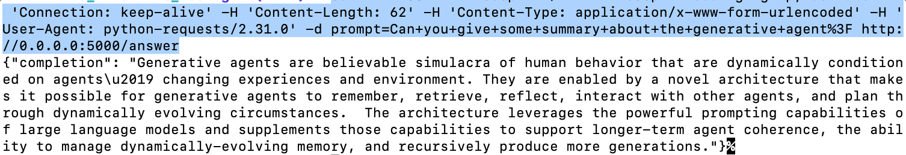

# System Design and Architecture
## The architecture diagram


## How it works:
1. The application receives query from user.
2. The query is sent to Flask app in a HTTP request.
3. Flask app: 
   1. makes embedding vectors out of the user query.
   2. sends embedding vectors to ChromaDB service.
4. ChromaDB 
   1. looks for the chunks that are semantically similar to the query.
   2. The results are sent to Flask app.
5. Flask app 
   1. creates the prompt for LLM using the **context** (chunks gotten from ChromaDB) and the **user query**
   2. Give the prompt to OpenAI.
6. Get the answer/completion from OpenAI API.
7. The answer is then shown to end user.

# LLM Model

## Base model
The underlying LLM model of the Q&A application is a finetuned `gpt-3.5-turbo`.

## Fine-tuning

### The process


### Why fine-tuning?
- The scope of this application is to provide information extracted from a research paper (Generative Agent) via a Q&A chatbot. Therefore, the answers should be trustworthy, relevant and stay within the scope of the base knowledge documentations.
- Fine-tuning helps the model do the task as required
    1.  without having to give further few-shot learning examples in the prompts.
    2.  one of the usecases for finetuning is to customize qualitative feel of the model output, such as its tone.
### Training examples
- Training examples are provided in `JSONL` format.
- The whole text is too large to fit into a prompt, so it is splitted into chunks.
- Q&A examples are generated as following steps:
  1. The texts are splitted into different pages (as given in the PDF file) with a little twist with overlapping chunking technique.
    - Without overlapping chunking, we might **accidentally cut off some important text between chunks**.
    - To mitigate the problem, about **10 sentences** (overlapped with **the directly previous and following pages**) is set to be added to the current page content.
  2. An additional context is generated by **concatenating the summaries of each page** (See file `data/page_summary.txt`).
  3. The `gpt-3.5-turbo` model is asked to generate example Q&As in the context of 23 pages and the summaries. As a result, ~180 examples were generated, it is splitted into 3 parts: train, validation and test.

### Fine tuning
This can be done by running `python finetune.py`.
Finetuning script:
```
finetune_job = openai.fine_tuning.jobs.create(
    training_file=train_file_id,
    validation_file=val_file_id,
    model="gpt-3.5-turbo-1106",
    hyperparameters={'n_epochs': 4, 'batch_size': 3}
)
```


## Retrieval-Augmented Generation for Large Language Models (RAG)

### Why RAG?
- Finetuning a existing LLMs to teach it some specific knowledge is not practical. It requires a lot of resources and time. For example, GPT-3.5 has 174B params, some hundred examples can do very little.
- RAG, an industrial standard technique, is done by retrieving relevant data/documents relevant to a question. Thanks to RAG, the LLM model is provided with accurate responses; Inherently less prone to hallucinations as each answer is grounded in retrieved evidence; provide domain-specific, relevant responses and much more cost-effective.

### Applying RAG
- This application generates embeddings of chunks from base knowledge document, store the embeddings in `ChromaDB`.
- ChromaDB finds chunks that are the most similar to the Questions, those chunks **act as the context in the prompt** for answer generator.

# Results
User can access Q&A application via the web UI or directly via the Flask API
| Web UI                          | Flask API                    |
| ------------------------------- | ---------------------------- |
|  |  |
|                                 |                              |

# Future improvements
## Web UI app
- The Streamlit UI is great for PoCs but also ineffective. The UI application should be improved to ensure scalability and customizable.
## Base knowledge
- Add papers in the references section to the base knowledge so the LLM model can provide more in-depth answers to the questions.
## Information indexing
- Using clustering to create semantic document: This approach involves **creating new documents by combining smaller chunks of information** that are semantically similar, we can use `Agglomerative Clustering` (progressivly merge small cluster by the distance between their components).

| Chunking with no overlap                   | Chunking with overlap (**current solution**) | Chunking by semantic similarity                       |
| ------------------------------------------ | -------------------------------------------- | ----------------------------------------------------- |
|  |     |  |
|                                            |                                              |                                                       |

## Hyperparameter tuning
- Hyperparameter tuning: 3 hyperparameters are exposed by OpenAI API, we can find the most performant combination of hyperparameters.

## Improving RAG architecture
- Lately, it is becoming more and more obvious that naive vector similarity search might not be accurate enough for all use cases. We can apply current advancements to improve the RAG architecture.
- Memory: Memory involves keeping tract of interactions - chat messages - with user so the model can extract knowledge from those interactions.